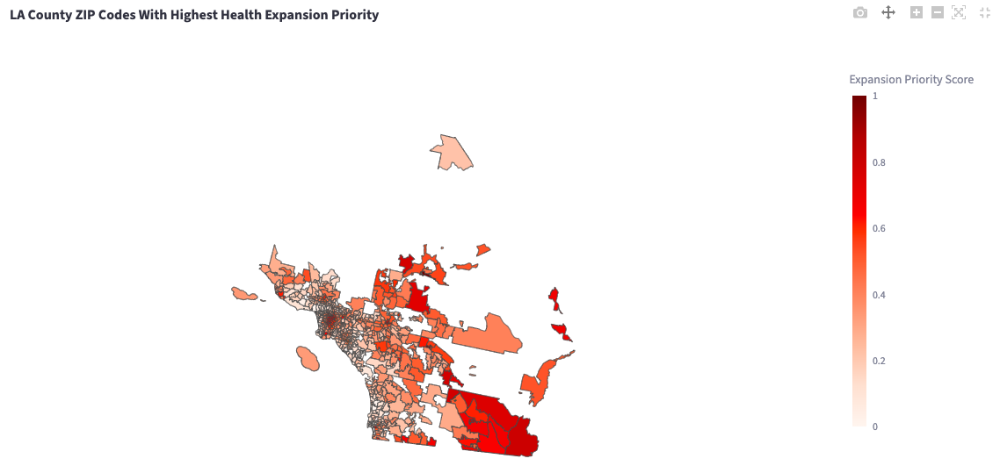
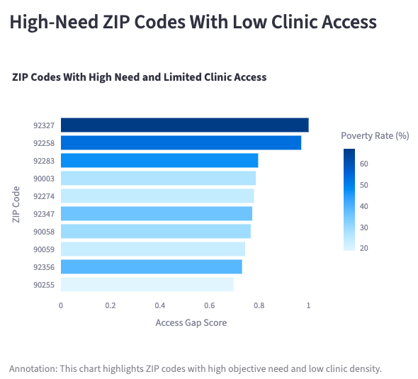
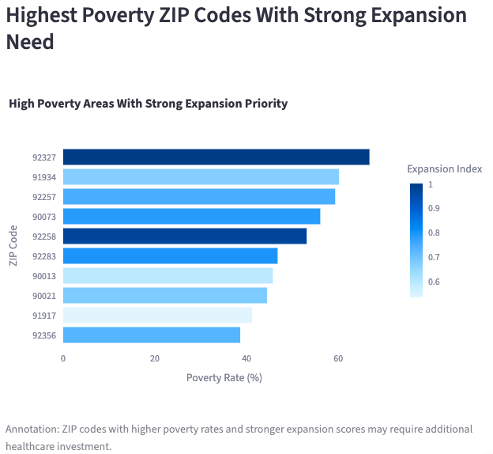
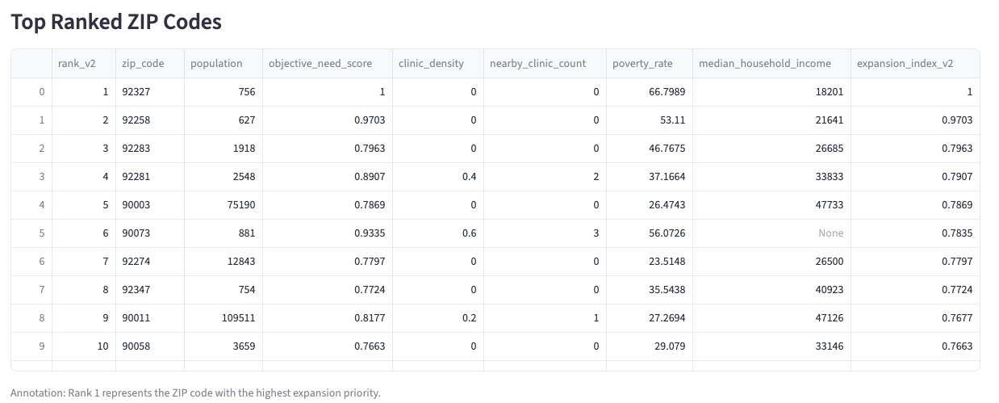

# LA Community Health Expansion Index

## Identifying High-Priority ZIP Codes for Healthcare Expansion in Los Angeles County

### Live Dashboard
https://lahealthexpansionindex.streamlit.app/

---

## Project Overview

The LA Community Health Expansion Index is a public health analytics project designed to identify underserved Los Angeles County ZIP codes where new community health centers may be most needed.

This project integrates healthcare accessibility, socioeconomic, and public health indicators to create a data-driven prioritization framework for healthcare expansion planning. The resulting dashboard and analytical models support identification of healthcare deserts, communities with elevated socioeconomic vulnerability, and regions with limited clinic accessibility.

The project was developed using Python, Streamlit, machine learning techniques, and public health datasets to provide an interactive healthcare decision-support tool.

---

## Business Problem

Healthcare resources are often distributed unevenly across communities, leaving some populations with limited access to preventative and primary healthcare services.

In Los Angeles County:
- Many ZIP codes have little or no nearby community healthcare infrastructure
- High-poverty communities may experience elevated barriers to healthcare access
- Healthcare expansion decisions are often difficult to prioritize objectively

This project addresses these challenges by building a transparent, reproducible healthcare expansion prioritization framework using data-driven analytics.

---

## Objectives

The goals of this project were to:

- Identify underserved ZIP codes with elevated healthcare need
- Quantify healthcare accessibility gaps across Los Angeles County
- Develop reproducible prioritization methodologies for healthcare expansion
- Compare subjective and data-driven weighting approaches
- Create an interactive dashboard for healthcare decision support
- Visualize healthcare deserts and expansion priority regions

---

## Data Sources

This project integrates publicly available datasets from multiple healthcare and socioeconomic sources.

### American Community Survey (ACS)
Used for:
- Poverty rates
- Median household income
- Population statistics
- Socioeconomic indicators

### CDC PLACES
Used for:
- Chronic disease burden
- Preventive care indicators
- Public health outcome measures

### FQHC / Community Clinic Data
Used for:
- Healthcare accessibility
- Clinic density
- Nearby clinic counts

### Geographic ZIP Code Data
Used for:
- ZIP-code-level choropleth mapping
- Geographic healthcare expansion visualization

---

## Repository Data Notice

Due to repository size limitations, the full raw datasets used during development are not stored in this repository.

This project utilized publicly available datasets from:
- American Community Survey (ACS)
- CDC PLACES
- Community clinic/FQHC accessibility data
- ZIP code geographic mapping data

The repository instead includes:
- analytical methodology
- cleaned workflows
- dashboard application code
- modeling notebooks
- visualizations
- project outputs

To reproduce the full analysis, users may replace local dataset paths with downloaded versions of the referenced public datasets.

---

## Methodology

## Version 1 — Weighted Composite Index

The initial model used manually assigned weights based on healthcare domain assumptions.

### Weight Categories
- Healthcare Need → 45%
- Demand → 30%
- Socioeconomic Factors → 25%

This version provided:
- interpretable scoring
- transparent weighting logic
- baseline prioritization rankings

---

## Version 2 — Ridge Regression Objective Model

The second version improved the methodology by replacing subjective weighting with data-driven weighting techniques.

### Improvements
- Integrated CDC PLACES health outcome indicators
- Used Ridge Regression-derived coefficients
- Reduced subjectivity in weighting
- Improved reproducibility
- Enhanced prioritization consistency

### Modeling Workflow
1. Data Cleaning
2. Feature Engineering
3. Standardization
4. Ridge Regression Weight Generation
5. Expansion Priority Scoring
6. ZIP Code Ranking
7. Dashboard Visualization

---

## Dashboard Features

The interactive Streamlit dashboard allows users to:

- Explore healthcare expansion priority scores across LA County
- Visualize healthcare deserts geographically
- Filter ZIP codes by:
  - Poverty rate
  - Clinic density
  - Objective need score
  - Expansion index score
- View top-ranked ZIP codes
- Analyze healthcare accessibility gaps
- Investigate underserved communities

---

## Dashboard Preview

### Healthcare Access Gap Analysis

### Poverty and Expansion Priority Analysis

### Top Ranked ZIP Codes

---

## Key Findings

- 57% of analyzed ZIP codes had zero nearby community health clinics
- High-priority ZIP codes demonstrated elevated poverty rates and lower healthcare accessibility
- Healthcare accessibility gaps were concentrated in communities with higher socioeconomic vulnerability
- Ridge Regression weighting improved objectivity and reproducibility of prioritization rankings
- Interactive dashboards improved accessibility of healthcare expansion insights for non-technical audiences

---

## Technologies Used

### Programming & Analytics
- Python
- Jupyter Notebook

### Data Analysis & Machine Learning
- pandas
- numpy
- scikit-learn

### Dashboarding & Visualization
- Streamlit
- Plotly
- Matplotlib

### Public Health Analytics
- Geospatial ZIP code mapping
- Healthcare accessibility analysis
- Composite index modeling

---

## Future Improvements

Potential future enhancements include:

- Incorporating healthcare utilization and emergency department visit data
- Adding travel-time accessibility analysis
- Integrating additional healthcare infrastructure datasets
- Developing predictive healthcare demand forecasting models
- Expanding the framework to other counties or states
- Incorporating real-time healthcare capacity indicators

---

## Business Impact

This project demonstrates how healthcare analytics and public health data can support data-driven healthcare expansion planning and resource allocation.

Potential applications include:

- FQHC expansion planning
- Preventive care targeting
- Public health investment prioritization
- Healthcare accessibility analysis
- Community health needs assessment
- Population health planning

---

## Contributors
- Mary Tekele
- Jasmine Cheng
- Aziza Jamjoom
- Sude Ademogullari
